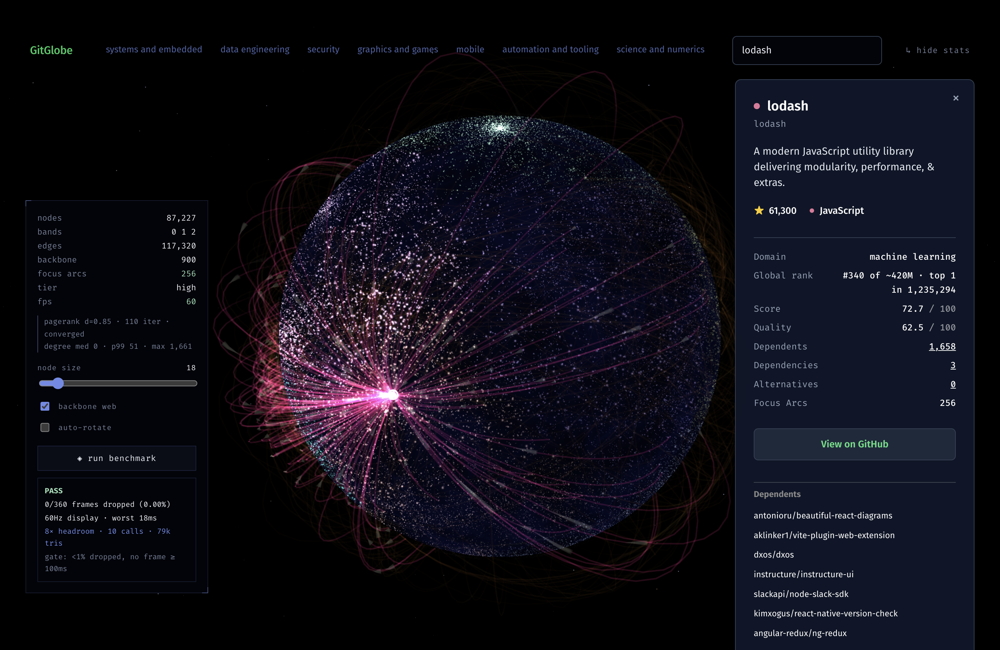
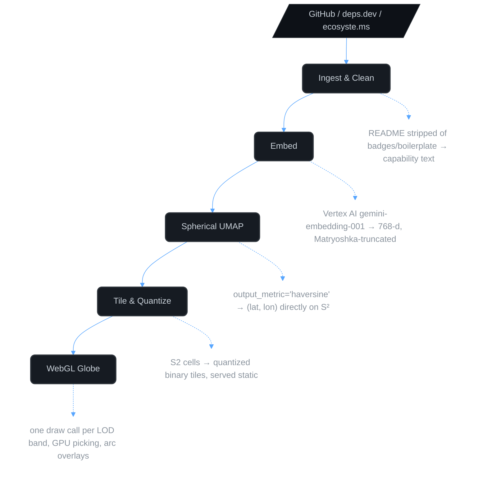

# GitGlobe 🌌


**A 3D interactive globe of the open-source universe.** 198,731 repositories placed on a sphere by what they *do*, not what they're called — navigable by dragging, pinching, and tapping, with search and per-domain filters that fly the camera there for you.

Every repository carries a **measured global rank** — its position among all ~420M public repositories, from an empirically sampled star distribution rather than an assumed power law — and a **quality score** distilled from an LLM into a gradient-boosted regressor that is never shown a star count.

<div align="center">
  
</div>

---

## Why this exists

Package discovery is still a text box and a ranked list. That format has three failure modes:

| Failure | What it costs you |
|---|---|
| **Keyword dependence** | A repo solving your exact problem is invisible if it uses different vocabulary. |
| **No sense of neighborhood** | You find one tool, never the eight alternatives sitting next to it. |
| **No sense of density** | You can't see that a niche is crowded (don't build there) or empty (opportunity). |

GitGlobe's premise: **capability is a continuous space, so render it as one.** Repositories that solve similar problems land in the same region of a sphere. Discovery becomes navigation.

---

## How it works



Five ideas do the heavy lifting:

**1. Semantic proximity over tags.** Topic tags are sparse, inconsistent, and self-reported. Embedding the actual README — after stripping the badge soup — captures what a project *does*.

**2. Native spherical projection.** Most projects run UMAP into 3D and then normalize onto a sphere. That's wrong: it throws away the radial dimension after the algorithm has already spent it. GitGlobe uses UMAP's `output_metric="haversine"`, which optimizes the layout *on the sphere's surface* from the start. No distortion, no wasted dimension. See [ADR-002](docs/ARCHITECTURE.md#adr-002-spherical-projection-method).

**3. The camera never takes a raw coordinate from outside the renderer.** Search results and domain filters resolve to real point positions and hand `globeCamera` a set of directions to frame — never a caller-supplied lat/lon. That's the same contract an agent would need if one were wired up to fly the camera: it would emit repository IDs, not coordinates, so it structurally cannot hallucinate a position. See [ADR-006](docs/ARCHITECTURE.md#adr-006-agent-camera-control-protocol).

**4. Edges are demand-loaded.** 198k nodes carry 206,247 directed edges, and drawing them all is neither possible nor useful — it's a hairball. A low-density "backbone" web (a few hundred to two thousand ambient arcs, tuned down further on touch devices) hints at structure at rest; a node's full neighborhood only lights up once it's focused.

**5. The ranking model is blindfolded to popularity.** An LLM teacher rates a stratified sample of repositories against a six-dimension rubric; a gradient-boosted regressor written from scratch in NumPy distils those judgements to the whole corpus. Star and fork counts are stripped from both the teacher's prompt and the student's features, enforced by tests — without that, the model just relearns stars under a new name. A dimension is only stored if its held-out RMSE beats predicting the mean by more than sampling noise.

**6. Rank is measured, not modelled.** GitHub's search API reports exact counts, so walking a star ladder yields the empirical survival function over hundreds of millions of repositories. A repository's rank is its position among *all* public repositories, not among the ones this corpus happens to hold — which would flatter every result by orders of magnitude.

---

## Stack

| Layer | Choice | Why |
|---|---|---|
| **Renderer** | three.js + React Three Fiber | Full shader control; a single draw call per LOD band for a 198k-point globe with custom glow. |
| **Camera** | `camera-controls` (yomotsu) | Promise-based `.setLookAt(..., enableTransition)` — purpose-built for scripted fly-to. |
| **Frontend** | React 19 + TypeScript + Vite + Zustand + TanStack Query | Fast HMR against a heavy WebGL scene; Zustand keeps camera state out of React's render path; Query owns the repo-detail and search fetches. |
| **API** | FastAPI (Python) + Pydantic | Same language as the ML pipeline; no model-serving bridge. |
| **Vector search** | Qdrant | Two collections: `gitglobe_repos` (768-d, layout) and `gitglobe_nv` (2048-d, retrieval) — see the note below on why they're separate. |
| **Metadata** | Postgres (asyncpg) | Repo rows, adjacency lists, cluster labels, full-text search for the lexical search arm. |
| **Layout embeddings** | Vertex AI `gemini-embedding-001` | Matryoshka-trained — truncating to 768-d costs ~0.26% quality for a quarter of the storage a 3072-d vector would need. Fixed once at ingest; the globe's coordinates are derived from these and must not move. |
| **Retrieval embeddings** | NVIDIA NIM `llama-nemotron-embed-1b-v2` | 2048-d, free tier, asymmetric `query`/`passage` encoding. Vertex billing is off (see below), so `/search` embeds queries here instead. |
| **Reduction** | `umap-learn` (CPU) | `output_metric="haversine"` isn't exposed by every accelerated UMAP implementation, so this stays a portable CPU stage rather than something the ingest step has to import. |
| **Pipeline orchestration** | Prefect | A single `gitglobe <subcommand>` CLI (ingest, clean, embed, project, cluster, edges, rank, build) rather than one monolithic run. |
| **Tiles** | Static binary blobs | S2-binned, quantized, served alongside the web app — no separate tile server. |

Full library-by-library breakdown with versions and rationale: [docs/IMPLEMENTATION_PLAN.md](docs/IMPLEMENTATION_PLAN.md#library-reference).

> **Why retrieval doesn't reuse the globe's own vectors:** the globe's layout comes from `gemini-embedding-001` vectors in `gitglobe_repos`, and those must never move — re-embedding them would shift every point on the sphere. `/search` needed a working embedder and the GCP billing account backing Vertex is closed, so retrieval writes to its own collection (`gitglobe_nv`, NVIDIA) instead. This used to be the opposite problem: the corpus was 768-d and the query path briefly embedded with a 1024-d model, a silent width mismatch that degraded every search to a Postgres substring match with nothing in the logs saying so. `api/tests/test_search_contract.py` pins the width and the query/passage sub-space so that class of bug fails a test instead of failing silently again.

---

## Key engineering challenges

This project pushes what a browser can render while holding a 60fps budget. A few of the non-trivial problems it had to solve:

- **Raw WebGL shader work.** Hundreds of thousands of points through a single `THREE.Points` draw call per LOD band required custom GLSL. Two examples from this codebase specifically: a GPU-picking pass that samples a small window around the pointer (not a single pixel) so a touch target isn't luck-of-the-pixel on a phone, and a sub-pixel fade that carries a point's below-one-pixel size into alpha instead of pinning it to 1px at full brightness — the pinned version is what made the whole field visibly twinkle as the globe rotated or zoomed.
- **Dynamic spherical geometry.** Dependency and similarity edges render as great-circle arcs across the sphere's surface, demand-loaded per focused node rather than drawn in bulk, to avoid the visual clutter of a hairball graph.
- **Vector space to spherical coordinates.** Bypassing the standard 3D-then-normalize UMAP distortion by using `output_metric="haversine"` to project embeddings natively onto the surface of a sphere ($S^2$).
- **A phone is not a small desktop.** The scene is fragment-bound, not geometry-bound, so the levers that matter on mobile are pixel ratio and translucent overdraw — not node count. Device tier now governs those two continuously (via a runtime fill-rate monitor) rather than dropping LOD bands, which used to make the visible corpus size swing between roughly 2%, 20%, and 100% of the data depending on whether a frame-time sample happened to land during tile upload or a backgrounded tab.

---

## Performance budget

These are the numbers the architecture is designed around. If a design choice breaks one, it's the wrong choice.

| Metric | Target | How |
|---|---|---|
| Points rendered | 1,000,000 (currently 198,731) | LOD bands, positions quantized to 2×`int16` lat/lon, xyz reconstructed in the vertex shader |
| Frame time | < 16.7 ms | One draw call per band, back-hemisphere culled in the vertex shader |
| Hover / tap pick | < 1 frame | GPU picking into a small render target, nearest-hit search within it |
| Semantic query p99 | < 200 ms | Qdrant HNSW + scalar quantization |
| Ambient arcs on screen | ≤ 2,000 (≤ 800 on touch) | A low-density backbone at rest; a node's full neighborhood only on focus |

Scaling to the full 1,000,000-point target is open work — see Roadmap.

---

## Repository layout

```
GitGlobe/
├── pipeline/                       # Python — offline corpus build
│   └── src/gitglobe/
│       ├── ingest/                 # GitHub GraphQL, BigQuery (GH Archive), criticality
│       ├── clean/                  # README → capability text
│       ├── embed/                  # Vertex AI gemini-embedding-001, whitening
│       ├── project/                # UMAP (haversine) + clustering into domains
│       ├── graph/                  # co-occurrence, PageRank, community stability
│       ├── rank/                   # measured global percentile, criticality blend
│       ├── brain/                  # LLM teacher → GBM student quality score
│       ├── tiles/                  # S2 binning → quantized binary tiles + manifest
│       ├── checks/                 # neighbourhood sanity checks
│       ├── cli.py                  # `gitglobe <subcommand>` entry point
│       └── flow.py                 # Prefect orchestration
├── api/                             # FastAPI
│   └── src/gitglobe_api/
│       ├── main.py                 # /search, /repo/{id}, /graph/{id}
│       └── seed_qdrant.py          # loads embeddings from Postgres into Qdrant
├── web/                             # React + React Three Fiber
│   └── src/
│       ├── globe/                  # renderer, shaders, LOD bands, GPU picking
│       ├── camera/                 # the one class allowed to touch the camera
│       ├── graph/                  # client-side pagerank/format helpers
│       ├── tile/                   # binary tile loader + format
│       ├── repo/                   # name/identity resolution, scoring display
│       ├── perf/                   # device tier detection
│       ├── bench/                  # in-app frame-budget benchmark
│       ├── store/                  # Zustand: camera, selection, filters, tier
│       └── ui/                     # HUD, search, detail panel, tutorial
└── docs/
    ├── ARCHITECTURE.md             # system design + ADRs
    └── IMPLEMENTATION_PLAN.md      # phased build plan, skills, libraries
```

`docker-compose.yml` for local Postgres/Qdrant/Redis lives in `pipeline/`, not a separate `infra/` directory.

---

## Quickstart

```bash
git clone https://github.com/yamantaka-singh/GitGlobe && cd GitGlobe

# --- services ---
cd pipeline && docker compose up -d      # postgres + qdrant + redis

# --- pipeline (each stage is its own subcommand) ---
uv venv && uv pip install -e ".[dev]"
# .env in this directory needs GITHUB_TOKEN, GCP credentials for Vertex AI,
# and DATABASE_URL — see settings.py for the full list, loaded via a small
# hand-rolled .env reader rather than python-dotenv.
uv run gitglobe ingest
uv run gitglobe embed      # layout vectors — costs money, Vertex AI billing
uv run gitglobe project    # UMAP, CPU, slow
uv run gitglobe cluster
uv run gitglobe edges
uv run gitglobe rank
uv run gitglobe build      # writes tiles + manifest for the web app
uv run gitglobe embed-nv   # retrieval vectors — free, NVIDIA NIM (NVIDIA_API_KEY)

# --- api ---
# .env needs NVIDIA_API_KEY for dense search; without it /search still works
# on the lexical + name arms alone.
cd ../api && uv run fastapi dev

# --- web ---
cd ../web && npm install && npm run dev
```

`gitglobe doctor` runs a full diagnostic (env, shard state, distribution, verdict) if a stage looks stuck; `gitglobe status` reports what's embedded, projected, and clustered so far.

---

## Data sources

| Source | Provides | Access | Notes |
|---|---|---|---|
| **GH Archive** | Event firehose since 2011 | Free, BigQuery | Star velocity and activity signals — better than raw star count |
| **GitHub GraphQL v4** | Metadata, README, topics | Token, 5k pts/hr | Use GraphQL not REST; one query fetches 100 repos with READMEs |
| **deps.dev (Open Source Insights)** | Cross-ecosystem dependency graph | Free, BigQuery + API | The source of truth for explicit edges — Google-maintained, covers npm/PyPI/Go/Maven/Cargo/NuGet |
| **ecosyste.ms** | Repo + package metadata, funding | Free REST | Excellent fallback and cross-registry reconciliation |
| **OSSF Criticality Score** | Project importance | Free dataset | Better node-size signal than stars alone |

Star count is a popularity proxy that heavily favours old repos. Node radius blends stars, recent activity, and criticality score — see [ADR-008](docs/ARCHITECTURE.md#adr-008-node-size-signal).

---

## Roadmap

- [x] Concept and spatial pipeline sketch
- [x] **Phase 0** — Render a synthetic point field at 60fps *(de-risks everything else)*
- [x] **Phase 1** — Ingest real repos, cleaned and enriched
- [x] **Phase 2** — Embed + spherical UMAP + S2 tiling
- [x] **Phase 3** — Real data on the globe, hover/tap, GPU picking, mobile input tuning
- [x] **Phase 4** — Hybrid search: dense (NVIDIA) + lexical (Postgres FTS) + exact-name arms, fused by weighted RRF with a star-count re-rank on the dense candidates. Measured recall@10 = 0.472 on a 30-query eval set (`api/tests/eval_search.py`), against a corpus ceiling of 0.709 — the gap is repos missing from the corpus, not retrieval quality.
- [ ] **Phase 5** — Wire an agent to the existing ID-based camera-control API; nothing calls it yet
- [x] **Phase 6** — Dependency and semantic arcs (directional, demand-loaded backbone web)
- [ ] **Phase 7** — Scale to 1,000,000 points, nebula labels, share-a-view URLs

Detailed tasks and exit criteria per phase: [docs/IMPLEMENTATION_PLAN.md](docs/IMPLEMENTATION_PLAN.md).

---

## Honest limitations

Worth stating up front, because they shape the product.

- **A sphere's surface is two-dimensional.** Projecting a high-dimensional capability space onto it loses real structure. Some repos will land near neighbours they have little to do with. The globe is a navigational metaphor with strong local fidelity, not a faithful map — treat cluster membership as a hint, not a claim.
- **UMAP is not incremental.** A newly indexed repo can't be placed without either refitting or a parametric encoder against a frozen reference layout, so daily additions can land in stable positions between refits. Coordinates therefore drift between refits, and any shared view URL would need to pin a layout version.
- **README quality is uneven.** Many repos have a title and a badge. Those embed poorly and cluster in a low-signal blob. Filtering on a minimum cleaned-README length is a quality lever, not a bug.
- **Popularity bias is real.** Any star-derived size or ranking amplifies the already-visible. The criticality-score blend mitigates it; it does not remove it.
- **Search recall is 0.472@10, not the 0.7 target.** The corpus ceiling is 0.709 — 34 of 117 eval-set repos aren't in the corpus at all — so 0.7 isn't reachable without ingesting more of them; retrieval itself is already at 70% of what's reachable.

---

## Documentation

- [Architecture & ADRs](docs/ARCHITECTURE.md) — components, data model, tile format, projection math, agent protocol, cost model
- [Implementation Plan](docs/IMPLEMENTATION_PLAN.md) — phases, skills matrix, AI-assisted workflow, library reference

## License

MIT — see [LICENSE](LICENSE).
